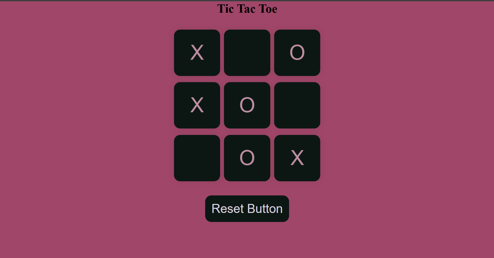
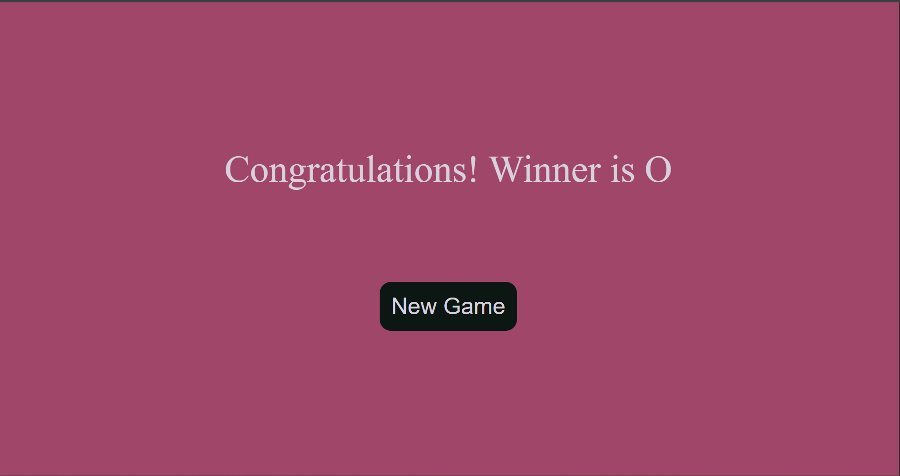
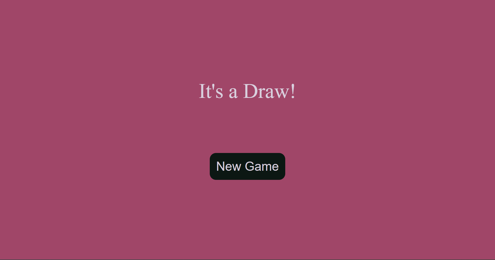

# Tic Tac Toe

A simple and clean Tic Tac Toe game built using **HTML**, **CSS**, and **JavaScript**.  
This project helped me practice basic DOM manipulation, event handling, and game logic.

## Features

- Two-player Tic Tac Toe  
- Highlights the winner  
- Reset and New Game buttons  
- Responsive & minimal UI  
- Beginner-friendly JavaScript code

### Game UI

### Winner Message

### Draw Message

## Technologies Used

- **HTML5**
- **CSS3**
- **JavaScript (Vanilla JS)**
